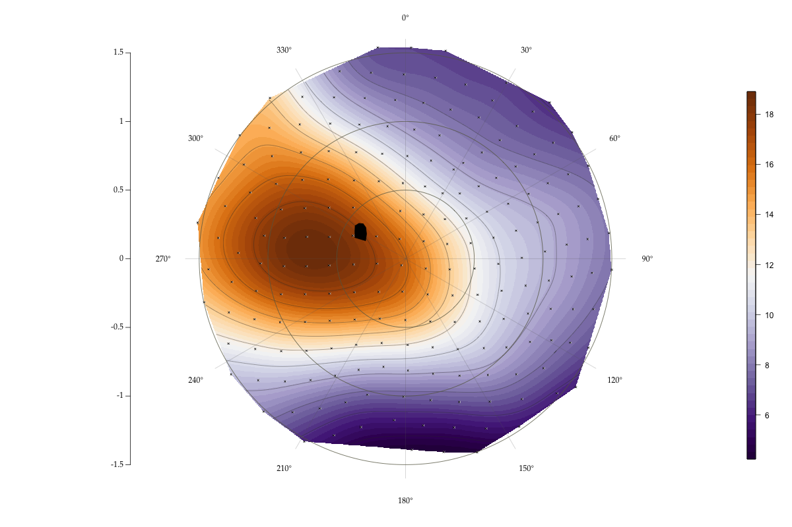

# 

Visualize & compare retinal cell data.


# [Link to paper](https://jov.arvojournals.org/article.aspx?articleid=2422880)
# How to cite the paper
```
Cohn, Brian A., et al. "Retinal topography maps in R: New tools for the analysis and visualization of spatial retinal data." Journal of vision 15.9 (2015): 19-19.
```
```
@article{cohn2015retinal,
  title={Retinal topography maps in R: New tools for the analysis and visualization of spatial retinal data},
  author={Cohn, Brian A and Collin, Shaun P and Wainwright, Peter C and Schmitz, Lars},
  journal={Journal of vision},
  volume={15},
  number={9},
  pages={19--19},
  year={2015},
  publisher={The Association for Research in Vision and Ophthalmology}
}
```
# Project description

Retinal maps can take several hours to construct by hand or with proprietary software, and have been the industry standard for over thirty five years—they appear in hundreds of publications. With our software, a researcher can produce *many* maps in one hour, make consistent comparisons, and generate useful statistics.

## Installation
- Download the latest release
- Open R and set the working directory to the unzipped `retina` folder
- Run `source("main.R")`. This will run the sample map.

It may complain that you don't have the right packages. To install them run e.g. `install.packages("ggplot2")`.

#### Questions/Ideas/Help
[Post a github issue ticket (15 seconds)](https://github.com/bc/retina/issues/new "Post an issue ticket")

#### Notes
1. Thank you to David Sterratt (Sterratt et. al. 2013) who designed and published the stitching algorithm. (GPL-2 License)
2. Color schemes were designed to be readable by viewers who may have colorblindness.

#### In Press
[Keck Science Department Announcement](http://www.kecksci.claremont.edu/News/Newsdetail.asp?NewsID=92 "KSD")

### Deployment Notes
```bash
sudo R -e "shiny::runApp(host="0.0.0.0",port=80)"
Deploykey: https://github.com/bc/retina/settings/keys
```
